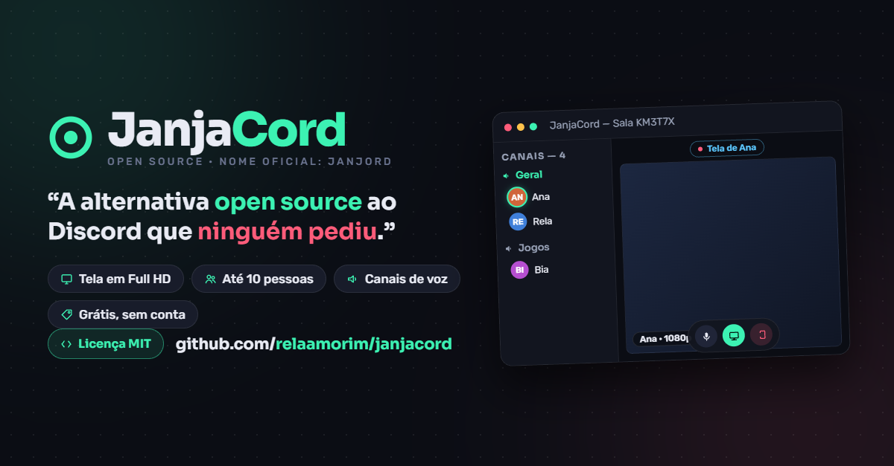

# Janjord 🟢

> **Nome oficial:** Janjord · **Codinome/meme:** JanjaCord
>
> *"A alternativa open source ao Discord que ninguém pediu."*



Aplicativo para Windows: salas de voz com **compartilhamento de tela em Full HD (1080p)**, **canais de voz**, **chat de texto** e até **duas transmissões simultâneas** — para até **10 pessoas**, conectadas pela internet, **sem conta, sem cadastro e sem servidor pago**. Gratuito e de código aberto.

### [⬇️ Baixar a última versão](https://github.com/relaamorim/janjacord/releases/latest)

Baixe o **`JanjaCord Setup <versão>.exe`** (instalador com atualização automática) ou o **`JanjaCord <versão>.exe`** (portátil, sem instalar).

## ⚠️ Atenção: o Windows mostra um aviso na instalação

O Janjord ainda **não tem assinatura digital** — esse certificado custa caro por ano, e este é um projeto gratuito e de código aberto. Por causa disso, na primeira execução o Windows mostra a tela azul do SmartScreen dizendo que o aplicativo é "desconhecido". **Isso é esperado, e a instalação é segura**: todo o código-fonte está aberto aqui neste repositório, para qualquer pessoa auditar.

**Passo a passo para continuar a instalação:**

1. Baixe o instalador na página de [Releases](https://github.com/relaamorim/janjacord/releases/latest) e execute.
2. Se aparecer a janela azul **"O Windows protegeu o computador"**, clique em **"Mais informações"**.
3. Vai surgir o botão **"Executar assim mesmo"** — clique nele.
4. Pronto! A instalação segue normalmente, cria o atalho e abre o aplicativo.

> 💡 Alguns navegadores também desconfiam na hora do download. No **Chrome/Edge**, se o download for marcado como "não verificado", clique nos três pontinhos ao lado do arquivo baixado e escolha **"Manter"** (e depois "Manter assim mesmo", se ele perguntar de novo).

## Como usar

1. Abra o JanjaCord e escreva seu nome.
2. Clique em **Criar uma sala** — você recebe um código de 6 letras (ex.: `KM3T7X`).
3. Mande o código para as pessoas (WhatsApp, e-mail, como preferir).
4. Elas abrem o JanjaCord, digitam o código e clicam em **Entrar**.
5. Pronto: todo mundo se ouve. Quem quiser mostra a tela clicando em **Compartilhar tela** — e podem ser **até duas telas ao mesmo tempo**.

### Canais de voz

Toda sala nasce com o canal **Geral**, e o **anfitrião** pode criar mais canais (botão **+** na barra lateral, até 8). Cada pessoa clica no canal em que quer ficar — você só **ouve** e só **vê a tela** de quem está no mesmo canal que você. Cada canal pode ter suas próprias **duas transmissões** simultâneas. O chat de texto continua sendo um só, da sala inteira.

### Dicas

- O botão de **engrenagem** (no lobby e na sala) abre as configurações: escolha do **microfone** (útil para não pegar o microfone da webcam), da **saída de som** (fones ou alto-falantes) e da **qualidade da transmissão** (HD 720p ou Full HD 1080p). Tudo fica salvo para as próximas vezes, e a troca de microfone funciona até no meio da chamada.
- **Clique em uma pessoa na lista** para abrir o controle de volume individual dela — perfeito para abaixar aquele microfone que está estourando.
- Com **duas transmissões ao mesmo tempo**, aparecem os botões de layout no canto do palco: **Dividida** (metade da tela para cada) ou **Foco** (uma grande e outra pequena no canto — clique na pequena para trocar qual fica em destaque).
- O botão de **balão de conversa** abre o chat de texto. Quando chega mensagem com o chat fechado, aparece um selo vermelho com a contagem. Quem entra na sala recebe as últimas 50 mensagens.
- Clique no **código da sala** (no topo) para copiá-lo.
- Na hora de compartilhar, dá para escolher **uma tela inteira ou só uma janela**, e marcar a caixinha para **transmitir também o som do computador**.
- **Dois cliques no vídeo** colocam a transmissão em tela cheia.
- A bolinha do avatar **brilha em verde** quando a pessoa está falando.
- A sala existe enquanto o **anfitrião** (quem criou) estiver nela. Se ele sair, a sala fecha.
- Clicar no **X** não fecha o JanjaCord: ele se recolhe para a **bandeja do sistema** (perto do relógio) e a chamada continua. Clique no ícone da bandeja para reabrir, ou clique nele com o botão direito e escolha **"Sair de vez"** para fechar de verdade.

## Como rodar em modo de desenvolvimento

```
npm install
npm start
```

## Como gerar o instalador (.exe)

```
npm run build
```

Os arquivos aparecem na pasta `dist`:

- `JanjaCord Setup <versão>.exe` — instalador (instala e cria atalho)
- `JanjaCord <versão>.exe` — versão portátil (basta dar dois cliques, sem instalar)

## Atualização automática 🔄

O JanjaCord se atualiza sozinho: quem instalou pelo **JanjaCord Setup** recebe as novas versões em segundo plano. Quando o download termina, aparece um aviso com **"Reiniciar agora"** (instala na hora e reabre sozinho) e **"Depois"** (instala quando o app for fechado de vez). A versão **portátil** não consegue se substituir, mas avisa quando existe versão nova e oferece a página de download.

As versões ficam publicadas em: https://github.com/relaamorim/janjacord/releases

> **Curiosidade técnica**: o app já se chamou MyDisc. Alguns identificadores internos (endereço das salas, código de instalação) continuam com o nome antigo de propósito — é isso que garante que quem instalou como MyDisc receba a atualização de nome automaticamente e continue entrando nas mesmas salas.

### Como lançar uma nova versão (para o dono do projeto)

1. Faça as mudanças no código.
2. Aumente o número em `"version"` no `package.json` (ex.: de `1.2.0` para `1.3.0`).
3. Rode:

```
$env:GH_TOKEN = (gh auth token --user relaamorim)
npm run publicar
```

Pronto: a versão sobe para o GitHub e todos os usuários recebem automaticamente.

## Como funciona por dentro (resumo)

- **Electron** — transforma a interface (HTML/CSS/JS) em um aplicativo de Windows. É a mesma base do Discord, Slack e WhatsApp Desktop.
- **WebRTC** — tecnologia de chamadas do navegador. O áudio e o vídeo vão **direto de um computador para o outro** (ponto a ponto), sem passar por servidor.
- **PeerJS** — serviço gratuito usado só no começo, como "ponto de encontro": é ele que faz o código da sala levar até o computador do anfitrião.
- **Full HD** — a captura é pedida em 1920×1080 a 30 quadros/s, com prioridade para **manter a resolução** (texto nítido) mesmo se a rede oscilar. Como quem transmite envia uma cópia para cada espectador, o aplicativo **divide automaticamente** um orçamento de ~18 Mbps entre eles (com 2 espectadores, até 6 Mbps cada; com 9, cerca de 2 Mbps cada).
- **Chat de texto** — as mensagens passam pelo anfitrião, que as distribui para todos e guarda as últimas 50 para mostrar a quem chegar depois.

## Contribuindo

Achou um problema ou tem uma ideia? Abra uma [issue](https://github.com/relaamorim/janjacord/issues). Quer mexer no código? O projeto é propositalmente simples: HTML, CSS e JavaScript puros com Electron — sem frameworks. Faça um fork, rode `npm install` e `npm start`, e mande seu pull request.

## Licença

[MIT](LICENSE) — use, copie, modifique e distribua à vontade, inclusive comercialmente. Só mantenha o aviso de copyright.

## Limitações conhecidas

- Em algumas redes muito restritas (certas empresas/universidades), a conexão direta entre computadores pode ser bloqueada. Nesses casos a chamada não completa — é uma limitação de rede, não do aplicativo.
- O som do computador junto com a tela funciona no **Windows** (nos outros sistemas, só o vídeo).
- Quem compartilha a tela envia uma cópia do vídeo para **cada** participante. A qualidade se ajusta sozinha ao número de espectadores, mas para uma sala cheia (9 espectadores) é bom que quem transmite tenha internet com **uns 20 Mbps de envio (upload)** — comum em conexões de fibra.
- O chat não guarda histórico depois que a sala fecha (as mensagens vivem só durante a conversa).
